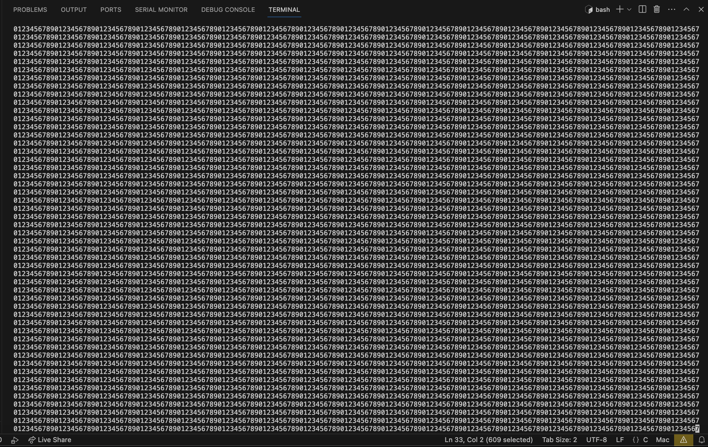

# ncurses_beeper
## about:
 just a little play around with ncurses

## screenshot:

## compilation:

- need to use `cc hello.c -o hello -lncurses` to compile
- or you can `make hello`

## usage:

- after compilation just use `./hello` in terminal

